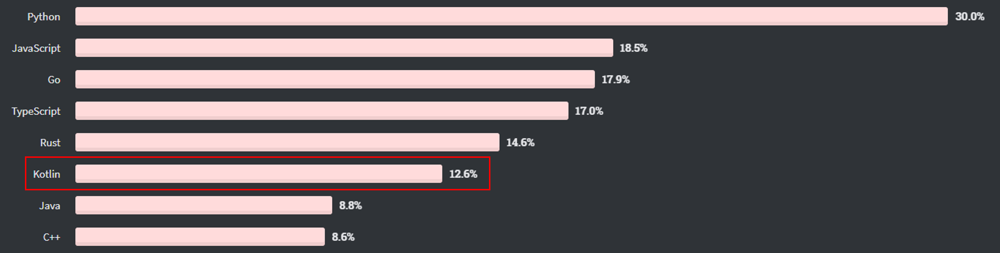
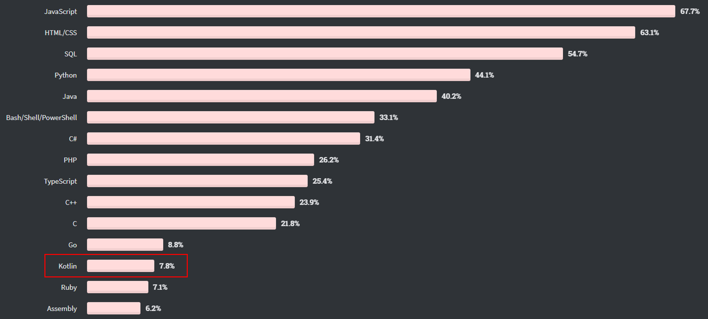
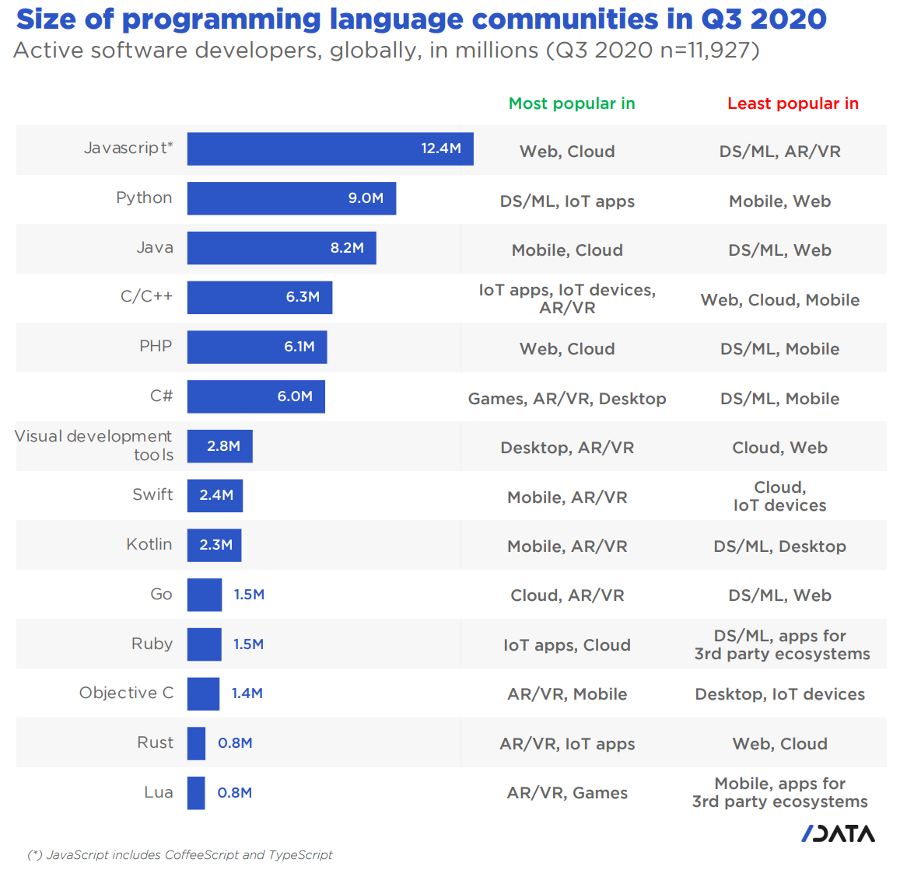

# KotlinNote
Note for Kotlin learning
# Table of Contents
1. [What is Kotlin](#what)
2. [Why you should use Kotlin](#why)
    * [Compatible with Java](#compatible)
    * [Suitable with and easy to use in Spring Boot](#suitable)
    * [Simple to transfor from Java using IntelliJ with ignorable effort](#transfor)
    * [Type inference & Smart cast](#typeinference)
    * [NO semicolon](#semicolon)
    * [Null pointer check](#null)
3. [Useful Features](#features)
    * [Elvis operator](#elvis)
    * [var & val](#var)
    * [String format ${}](#string)
    * [Mutable collection](#mutable)
    * [data class](#data)
    * [enum & sealed class](#enum)
    * [more powerful Lambda expression](#lambda)
    * [and more ...](#more)
4. [References](#references)
# What is Kotlin <a name="what"></a>

> Keywords: Cross-platform with JVM, Static typed programming language, Combines the features of OOPs and functional-oriented programming.

Kotlin (/ˈkɒtlɪn/) is a **cross-platform, statically typed**, general-purpose programming language with type inference. Kotlin is designed to interoperate fully with Java, and the JVM version of Kotlin's standard library depends on the Java Class Library, but type inference allows its syntax to be more concise. Kotlin mainly targets the **JVM**, but also compiles to JavaScript (e.g. for frontend web applications using React) or native code (via LLVM), e.g. for native iOS apps sharing business logic with Android apps. Language development costs are borne by JetBrains, while the Kotlin Foundation protects the Kotlin trademark.

On 7 May 2019, Google announced that the Kotlin programming language is now its preferred language for Android app developers. As a result many developers have switched to Kotlin Since the release of Android Studio 3.0 in October 2017, Kotlin has been included as an alternative to the standard Java compiler. The Android Kotlin compiler targets Java 6 by default, but lets the programmer choose to target Java 8 up to 13, for optimization, or more features.

> Though in this note, we more focus on Kotlin applying in **Web Service**.

In Stack Overflow Annual Developer Survey 2020, Kotlin got 4th in developers most loved language, 6th in most wanted, and 13th in most popular.

> Most Loved
> 

> Most Wanted
> 

> Most Popular
> 

And the size of Kotlin communities in Q3, 2020 ranked 9th.


# Why you should use Kotlin <a name="why"></a>
## Interoperable with Java <a name="compatible"></a>
We can use all the Java Libraries in Kotlin, and vice versa. Thus, in a Java project, we can partially add or step by step to transform the codes to Kotlin.

We have a Java library like this.
``` java
package sample.java.library;

public class HelloWorld {
   public void print() {
      System.out.println("Hello World!!");
   }
}
```
And we can directly import and use the class in Kotlin.
``` kotlin
import sample.java.library

class testHelloWorld {
   fun testHelloWorld() {
      val helloWorld = HelloWorld()
      helloWorld.print()   // will print "Hello World!!" in console
   }
}
```

## Suitable with and easy to use in Spring Boot <a name="suitable"></a>
We only need to config some dependencies and plugins in Maven POM.  
Assume that we already have some Maven configuration for Java project.

Dependencies
``` xml
<properties>
   <java.version>1.8</java.version>
   <kotlin.version>1.4.72</kotlin.version>
</properties>

<dependencies>
   <!-- this library include kotlin-stdlib & kotlin-reflect -->
   <dependency>
      <groupId>com.fasterxml.jackson.module</groupId>
      <artifactId>jackson-module-kotlin</artifactId>
   </dependency>
...
</dependencies>
```
Plugins
``` xml
<plugin>
    <artifactId>kotlin-maven-plugin</artifactId>
    <groupId>org.jetbrains.kotlin</groupId>    
    <dependencies>
        <dependency>
           <groupId>org.jetbrains.kotlin</groupId>
           <artifactId>kotlin-maven-allopen</artifactId>
           <version>${kotlin.version}</version>
        </dependency>
        <dependency>
           <groupId>org.jetbrains.kotlin</groupId>
           <artifactId>kotlin-maven-noarg</artifactId>
           <version>${kotlin.version}</version>
        </dependency>
    </dependencies>
    <executions>
        <execution>
            <id>compile</id>
            <goals>
                <goal>compile</goal>
            </goals>
            <configuration>
                <sourceDirs>
                    <sourceDir>${project.basedir}/src/main/kotlin</sourceDir>
                    <sourceDir>${project.basedir}/src/main/java</sourceDir>
                </sourceDirs>
            </configuration>
        </execution>
        <execution>
            <id>test-compile</id>
            <goals>
                <goal>test-compile</goal>
            </goals>
            <configuration>
                <sourceDirs>
                    <sourceDir>${project.basedir}/src/test/kotlin</sourceDir>
                    <sourceDir>${project.basedir}/src/test/java</sourceDir>
                </sourceDirs>
            </configuration>
        </execution>
    </executions>
</plugin>
```

## Simple to transform from Java using IntelliJ with ignorable effort <a name="transfor"></a>
With the strong function of IntelliJ, we can leverage it to convert Java file to Kotlin code.

After conversion, we almost no need to do anything. While sometimes to fix the complilation error, we need to modify the null safety (add `!!`, `?`, or other null value check), getter and setter (in Kotlin, `object.getSomething()` is simplify as `object.something`).

## Type inference & Smart cast <a name="typeinference"></a>
Kotlin is a **statically type language**. Regarding to that specification, that means that the compiler will know what is the type of a variable or the return type of a function. That's why you can write `val str = “hello”` instead of `val str: String = “hello”`, or even `fun sum(ints: List<Int>) = ints.sum()` instead of `fun sum(ints: List<Int>): Int = ints.sum()`. In a lot of cases you will be allowed to omit the declaration type, so your code should be more concise.

``` kotlin
val str: String = “Hello”
val str = “Hello” // same as above, but more concise
```

There are two kinds of *type inference* supported by Kotlin.
1.	*Local type inference*: for inferring types of expressions locally, in statement/expression scope.
2.	*Function signature type inference*: for inferring types of function return values and/or parameters.

### Smart cast

But before type inference, we need to talk *smart cast* first.

``` kotlin
// Note: the most important exception when smart casts are used in type inference is direct property declaration.

fun noSmartCastInInference() {
   var a: Any? = null
   if (a == null) return
   var c = a // Direct property declaration

   c // Declared type of `c` is Any?
     // However, here it’s smart casted to Any
}

fun <T> id(a: T): T = a

fun smartCastInInference() {
   var a: Any? = null
   if (a == null) return
   var c = id(a)
   
   c // Declared type of `c` is Any
}
```
### Local Type Inference

Local type inference in Kotlin is the process of deducing the compile-time types of expressions, lambda expression parameters and properties.

Type inference in Kotlin is **bidirectional**; meaning the types of expressions may be derived not only from their arguments, but from their usage as well. Note that, albeit bidirectional, this process is still local, meaning it processes one statement at a time, strictly in the order of their appearance in a scope; e.g., the type of property in statement S1 that goes before statement S2 cannot be inferred based on how S1 is used in S2.

### Function Signature Type Inference

Function signature type inference is a variant of local type inference, which is performed for *[function declarations], lambda literals and anonymous function declarations*.

Named and anonymous function declarations

``` kotlin
fun <T> foo(): T { … }
fun bar(): Int = foo() // an expected constraint T’ <: Int
// allows the result of `foo` to be infereed automatically.
```

Statements with lambda literals

``` kotlin
fun <T> foo(): T { … }
fun <R> run(body: () -> R): R { … }

fun bar() {
   val x = run {
      run {
         run {
            foo<Int>() // last expression inferred to be of type Int
         } // this lambda is inferred to be of type () -> Int
      } // this lambda is inferred to be of type () -> Int
   } // this lambda is inferred to be of type () -> Int
   // x is inferred to be type Int

   val y: Double = run { // this lambda has an external constraint R’ <: Double
      run { // this lambda has an external constraint R’ <: Double
         foo() // this call has an external constraint T’ <: Double
               // allowing to infer T to be Double in foo
      }
   }
}
```


## NO semicolon <a name="semicolon"></a>
In Kotlin, we don't need to use semicolon in the end of statement.  
Java
``` java
String str = "Hello";
String strAppend = str + " World!!";
```
Kotlin
``` kotlin
val str = "Hello"
val strAppend = "$str World!!"
```
We only need to add semicolon in these two cases:
1. An enum class that has a list of enums and also properties or functions
``` kotlin
enum class Things {
    ONE, TWO;
    
    fun isOne(): Boolean = this == ONE
}
```
2. Two statements in one line
``` kotlin
val str = "Hello"; println(str)
```

## Null pointer check <a name="null"></a>
In Kotlin, there are `!!` and `?` operators, which are used for null safety. This feature can pre-check the codes to prevent NullPointerException in runtime caused by thoughtless programmer.

Regular initialization means non-null by default.
``` kotlin
var a: String = "abc" // Regular initialization means non-null by default
a = null // compilation error
```
If we need to declare a nullable variable.
``` kotlin
var b: String? = "abc" // can be set null
b = null // ok
print(b)
```
And if we consume that the variable won't be null.
``` kotlin
var b: String? = "abc" // can be set null
if (StringUtils.isEmpty(b)) {
   return
} else {
   doSomething(b!!) // if no "!!", it will has a compilation error
}

fun doSomething(b: String) { // this function only accept non-null parameter
   ...
}
```

# Useful Features <a name="features"></a>
## Elvis operator <a name="elvis"></a>
## type inference - var & val <a name="var"></a>
## String format ${} <a name="string"></a>
## Mutable collection <a name="mutable"></a>
## data class <a name="data"></a>
## enum & sealed class <a name="enum"></a>
## more powerful Lambda expression <a name="lambda"></a>
## and more ... <a name="more"></a>
# References <a name="references"></a>
1. [Kotlin Proframming Language](https://kotlinlang.org/)
2. [Kotlin Language Spec](https://kotlinlang.org/spec/introduction.html)
3. [Kotlin Starter Pack - Type inference, checks, and smart casts](https://www.codingame.com/playgrounds/5529/kotlin-starter-pack/type-inference-checks-and-smart-casts)
4. [Kotlin Wiki](https://en.wikipedia.org/wiki/Kotlin_(programming_language))
5. [Elvis Operator](https://zh-tw.coderbridge.com/series/794d69188e074c5e81abedfcb649b809/posts/f84fef99ba074b16aa520c7f095fe737)
6. [長的帥，連Code都是香的 - Elvis Operator ?:](https://ithelp.ithome.com.tw/articles/10231089)
7. [Spring Boot and Kotlin](https://www.baeldung.com/kotlin/spring-boot-kotlin)
8. [Create a Java and Kotlin Project with Maven](https://www.baeldung.com/kotlin/maven-java-project)
9. [初探 Kotlin Lambda 表達式](https://medium.com/@louis383/%E5%88%9D%E6%8E%A2-kotlin-lambda-%E8%A1%A8%E9%81%94%E5%BC%8F-cfe8796c9fac)
10. [Java vs. Kotlin: Lambdas and Functions](https://dzone.com/articles/java-vs-kotlin)
11. [Kotlin vs Java: What's the Difference?](https://www.guru99.com/kotlin-vs-java-difference.html)
12. [What are the rules of semicolon inference?](https://stackoverflow.com/questions/39318457/what-are-the-rules-of-semicolon-inference)
13. [Project Lombok](https://projectlombok.org/)
14. [Stack Overflow Annual Developer Survey 2020](https://insights.stackoverflow.com/survey/2020#overview)
15. [SlashData State of the Developer Nation Q3 2020 Report](https://slashdata-website-cms.s3.amazonaws.com/sample_reports/y7fzAZ8e5XuKCL1Q.pdf)
